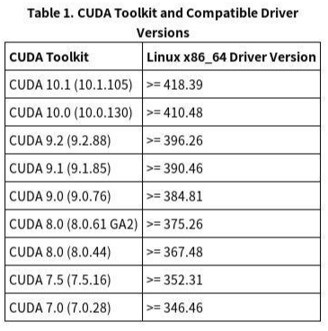
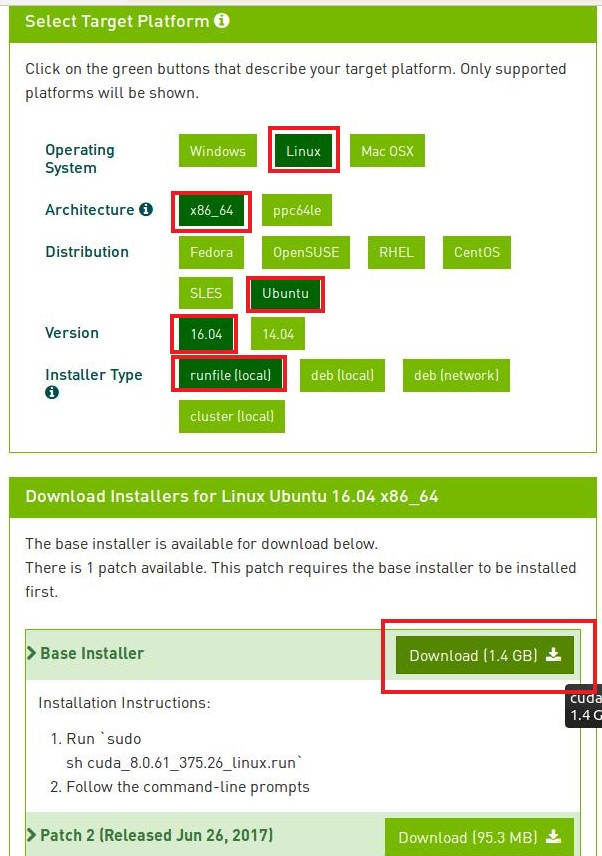
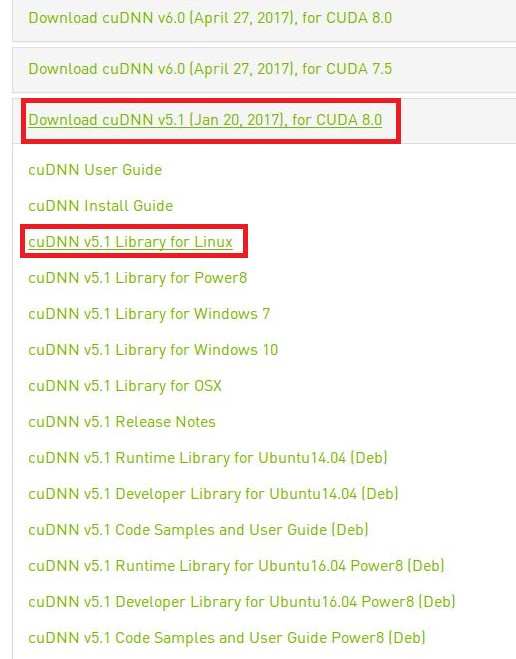

linux mint 18.3
GTX1060 3GB
nvidia-384.130

# CUDA Toolkit 8.0 install

> chmod +x cuda_8.0.61_375.26_linux.run  
sudo ./cuda_8.0.61_375.26_linux.run

You are attempting to install on an unsupported configuration. Do you wish to continue?  
`y`

Install NVIDIA Accelerated Graphics Driver for Linux-x86_64 375.26? (y)es/(n)o/(q)uit:  
`n ( 이미 설치 했습니다 )`

Install the CUDA 8.0 Toolkit? (y)es/(n)o/(q)uit:  
`y` 

Enter Toolkit Location [ default is /usr/local/cuda-8.0 ]:  
`( 엔터(Enter) 치기 ) - default 경로 묻는 겁니다 `

Do you want to install a symbolic link at /usr/local/cuda? (y)es/(n)o/(q)uit:  
`y `

Install the CUDA 8.0 Samples? (y)es/(n)o/(q)uit:  
`n ( 샘플 필요 없습니다 )`

설치 후 default 경로가 다르기 때문에 에러가 뜸.  
일단 재부팅  

> cd ~/.bashrc

    export CUDA_HOME=/usr/local/cuda
    export LD_LIBRARY_PATH=${CUDA_HOME}/lib64

    PATH=${CUDA_HOME}/bin:${PATH}
    export PATH 

위 코드 추가 후 저장

> source ~/.bashrc  
> nvcc -V  

    nvcc: NVIDIA (R) Cuda compiler driver
    Copyright (c) 2005-2016 NVIDIA Corporation
    Built on Tue_Jan_10_13:22:03_CST_2017
    Cuda compilation tools, release 8.0, V8.0.61

위와 같은 결과가 나오면 CUDA 8.0 설치 성공

# cuDNN 5.1 install
cuDNN을 받기 위해선 별도의 회원가입이 필요함. ( 구글계정 사용가능 )

>cd < cuDNN 5.1 을 다운로드 받은 경로 >  
sudo tar -xzvf cudnn-8.0-linux-x64-v5.1.tgz  
cd cuda  
sudo cp include/cudnn.h /usr/local/cuda/include  
sudo cp lib64/libcudnn* /usr/local/cuda/lib64  
sudo chmod a+r /usr/local/cuda/lib64/libcudnn*  
cat /usr/local/cuda/include/cudnn.h | grep CUDNN_MAJOR -A 2

    n.h | grep CUDNN_MAJOR -A 2
    #define CUDNN_MAJOR      5
    #define CUDNN_MINOR      1
    #define CUDNN_PATCHLEVEL 10
    --
    #define CUDNN_VERSION    (CUDNN_MAJOR * 1000 + CUDNN_MINOR * 100 + CUDNN_PATCHLEVEL)

    #include "driver_types.h"

위와같이 화면이 나오면 성공.

