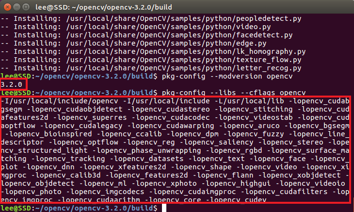

# libraries install

>sudo apt update  
sudo apt upgrade  
sudo apt install g++  
sudo apt install cmake

>sudo apt-get install build-essential cmake pkg-config libjpeg-dev libtiff5-dev libjasper-dev libpng12-dev libavcodec-dev libavformat-dev libswscale-dev libxvidcore-dev libx264-dev libxine2-dev libv4l-dev v4l-utils libgstreamer1.0-dev libgstreamer-plugins-base1.0-dev libqt4-dev mesa-utils libgl1-mesa-dri libqt4-opengl-dev libatlas-base-dev gfortran libeigen3-dev python2.7-dev python3-dev python-numpy python3-numpy  

if occurr this error
>E: Unable to locate package libjasper-dev
E: Package 'libpng12-dev' has no installation candidate  

you can use this command
>sudo add-apt-repository 'deb http://security.ubuntu.com/ubuntu xenial-security main'
sudo apt update
sudo apt install libjasper1 libjasper-dev

# OpenCV 3.2 install

>mkdir opencv  
cd opencv  
wget -O opencv.zip https://github.com/Itseez/opencv/archive/3.2.0.zip  
unzip opencv.zip  
wget -O opencv_contrib.zip https://github.com/Itseez/opencv_contrib/archive/3.2.0.zip  
unzip opencv_contrib.zip  

# Build
> cd opencv-3.2.0/  
mkdir build  
cd build  

>cmake -D CMAKE_BUILD_TYPE=RELEASE -D CMAKE_INSTALL_PREFIX=/usr/local -D WITH_TBB=OFF -D WITH_IPP=OFF -D WITH_1394=OFF -D BUILD_WITH_DEBUG_INFO=OFF -D BUILD_DOCS=OFF -D INSTALL_C_EXAMPLES=ON -D INSTALL_PYTHON_EXAMPLES=ON -D BUILD_EXAMPLES=OFF -D BUILD_TESTS=OFF -D BUILD_PERF_TESTS=OFF -D ENABLE_NEON=ON -D WITH_QT=ON -D WITH_OPENGL=ON -D OPENCV_EXTRA_MODULES_PATH=../../opencv_contrib-3.2.0/modules -D WITH_V4L=ON -D WITH_FFMPEG=ON -D WITH_XINE=ON -D BUILD_NEW_PYTHON_SUPPORT=ON -D PYTHON_INCLUDE_DIR=/usr/include/python2.7 -D PYTHON_INCLUDE_DIR2=/usr/include/x86_64-linux-gnu/python2.7 -D PYTHON_LIBRARY=/usr/lib/x86_64-linux-gnu/libpython2.7.so ../  

>sudo make -j  
// 참고로 -j 명령어 입력 후, 너무 느려지거나 렉이 걸릴경우, -j2, -j3 등 여러가지 수를 붙일것. 뒤에붙는 숫자는 사용할 코어의 수.

>sudo make install

>pkg-config --modversion opencv  
pkg-config --libs --cflags opencv

