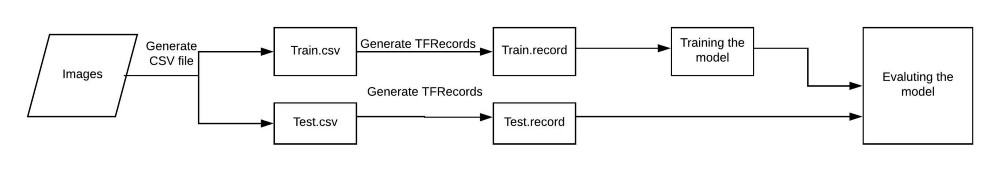

1) images를 입력받는다
2) images들로 부터 각 image의 csv를 뽑는데, 
이 부분은 Train을 진행할 때에는 csv가 필요하기 때문에 필요한 부분이다.
3) csv데이터를 TFRecords로 바꿔주는데, 
이는 이름에서부터 알 수 있듯이 Tensorflow에서 쓰는 데이터 형식으로 바꿔주겠다는 뜻이다.
4) 그리고 Training Model을 정한다. 
나는 여기서 ssd_mobilenet_v1_coco를 사용하는 것으로 진행한다.
다양한 모델이 있고 각 목적에 따라 모델을 다르게 구성해야 한다.  
모델은 알고리즘과는 다르지만 이해하기 힘들다면 
딥러닝에서 알고리즘부분을 포함하는 학습하는 부분이라고 이해하고 일단 넘어가자. 
5) 훈련시킨 모델을 평가한다.(생략가능)

train.py가 있는곳에 다음 폴더들을 만든다.

> cd ~/ml/models/research/object_detection/legacy  
> mkdir data images training eval

- data/ — records and csv files.
- images/ — dataset.
- training/ —save trained model.
- eval/ — save results of evaluation on trained model

## step 0 : 만들려고하는 데이터셋의 모음을 만들자.
0-1. 엘리베이터 사진 모음을 모은다, 간편하게 인터넷을 이용해서 데이터셋을 구하자.  
https://eehoeskrap.tistory.com/175  
0-2. 이미지들의 이름을 통일시켜주자. img1.jpg, img2.jpg...

## step 1 : 이미지로부터 .csv파일을 뽑아내자
labelImg를 이용한다. : https://github.com/tzutalin/labelImg

> cd ~/ml
> git clone https://github.com/tzutalin/labelImg
 
본인의 환경에 맞게 깃에 설명된 순서를 따라간다.
본인은 [Ubuntu Linux + Python 3 + Qt5]설정을 따른다.
  
> sudo apt-get install pyqt5-dev-tools  
> cd ~/ml/labelImg
> sudo pip3 install -r requirements/requirements-linux-python3.txt  
> make qt5py3  
> python3 labelImg.py

라벨링을 한뒤 save 버튼을 누르면 xml 파일이 생성된다.

xml을 사용하여 csv파일을 만든다.

> git clone https://github.com/datitran/raccoon_dataset  
> cd raccoon_dataset 

여기서 xml_to_csv.py 파일을 사용할건데 약간의 수정이 필요하다.

    def main():
        for directory in ['train','test']:
        image_path = os.path.join(os.getcwd(), 'images/{}'.format(directory))
        xml_df = xml_to_csv(image_path)
        xml_df.to_csv('data/{}_labels.csv'.format(directory), index=None)
        print('Successfully converted xml to csv.')

    main()

>python3 xml_to_csv.py  

반드시, data, images 폴더들이 존재해야한다.  

## step 3: 자, 이제 csv파일을 만들었으니 이를 기반으로 tfRecords를 만들어보자.

우리는 깃 저장소에서 generate_tfrecord.py 파일을 사용할 것이다.  
여기에서 잠깐! 바로 쓰지말고 약간의 수정이 필요하다.  
30lines - 자신의 데이터셋에 맞게 붙인 라벨의 갯수만큼 추가한다.  
단, 자신의 라벨링에 맞게 반드시 바꿔줘야 한다.

    def class_text_to_int(row_label): 
        if row_label == 'man_10':
            return 1
        elif row_label == 'man_20':
            return 2
        elif row_label == 'man_30':
            return 3
        else:
            return 0 #instead of None
 
### Create train data:
>python3 generate_tfrecord.py --csv_input=data/train_labels.csv  --output_path=data/train.record

### Create test data:
>python3 generate_tfrecord.py --csv_input=data/test_labels.csv  --output_path=data/test.record

## step 4:  Training
예측 속도와 정확성은 반비례한다. 속도가 빠르면 정확성은 떨어지고, 속도가 느리면 정확성은 올라간다.
1) 텐서플로우에서 제공되는 모델 중에 하나를 선택해보자.
https://github.com/tensorflow/models/blob/master/research/object_detection/g3doc/detection_model_zoo.md   
본인은 ssd_mobilenet_v1_coco를 pre-trained 모델로 선정했다.
 
2) 모델을 선택했으면 그와 맞는 Config file을 다운로드한다.
https://github.com/tensorflow/models/tree/master/research/object_detection/samples/configs  
본인은 ssd_mobilenet_v1_coco.config를 선정했다.
 
3) object-detection.pbtxt파일을 만든다.(여러개의 클래스를 가지고 있다면 여러개 적는다.)  
예를 들면, 다음과 같이 적을 수 있다.  

        item {
            id: 1
            name: 'man_10'
        }

        item {
            id: 2
            name: 'man_20'
        }

        item {
            id: 3
            name: 'man_30'
        }

4) config파일을 좀 수정해보자.  
    a)

        9lines,
        #before
        num_classes: 90
        #After-위의 예시에서는 버튼 1,2,3을 찾고 있으니 3개의 클래스를 만든다.
        num_classes: 3
 
    b) GPU가 별로 좋지 않다면, batch_size를 줄이자.  
        (+학습속도도 빨라진다. 대신 정확도는 이전보다 떨어진다.)
     
        batch_size:24
 
    c) 위에서 사용하기로 한 모델에 대한 위치를 작성한다.  

        #before
        fine_tune_checkpoint: "PATH_TO_BE_CONFIGURED/model.ckpt"
        #after - 문제가 있다면, 전체경로를 적어주자.
        fine_tune_checkpoint: "ssd_mobilenet_v1_coco/model.ckpt"
    
    d) train.record 파일의 위치를 주자.  
    
        #before
        train_input_reader: {  
        tf_record_input_reader {   
            input_path: "PATH_TO_BE_CONFIGURED/mscoco_train.record"
        }
            label_map_path: "PATH_TO_BE_CONFIGURED/mscoco_label_map.pbtxt"
        }

        #after- train.py를 기준으로 존재하는 디렉터리/파일 경로 명시
        train_input_reader: {  
            tf_record_input_reader {   
                input_path: "data/train.record"
            }
            label_map_path: "data/object-detection.pbtxt"
        }
    
    e) test.record 파일의 위치를 주자.  
    
        #before
        eval_input_reader: {  
            tf_record_input_reader {
                input_path: "PATH_TO_BE_CO c) 위에서 사용하기로 한 모델에 대한 위치를 작성한다.  

        #before
        fine_tune_checkpoint: "PATH_TO_BE_CONFIGURED/model.ckpt"
        #after - 문제가 있다면, 전체경로를 적어주자.
        fine_tune_checkpoint: "ssd_mobilenet_v1_coco/model.ckpt"
    
    d) train.record 파일의 위치를 주자.  
    
        #before
        train_input_reader: {  
        tf_record_input_reader {   
            input_path: "PATH_TO_BE_CONFIGURED/mscoco_train.record"
        }
            label_map_path: "PATH_TO_BE_CONFIGURED/mscoco_label_map.pbtxt"
        }

        #after- train.py를 기준으로 존재하는 디렉터리/파일 경로 명시
        train_input_reader: {  
            tf_record_input_reader {   
                input_path: "data/train.record"
            }
            label_map_path: "data/object-detection.pbtxt"
        }
    
    e) test.record 파일의 위치를 주자.  
                input_path: "data/test.record" 
            }
            label_map_path: "data/object-detection.pbtxt"  
            shuffle: false
            num_readers: 1
        }
    
    f) 자, 이제 명령어를 이용해서 훈련시키자.  
    >python3 train.py --logtostderr --train_dir=training --pipeline_config_path=training/ssd_mobilenet_v1_coco.config 
    
    g) 완료되고나면 ckpt파일(ckpt.data~, ckpt.index~, ckpt.meta~)가 training 폴더에 생긴다. 그 세가지가 그냥 ckpt파일이다.  

5) .ckpt파일을 이용해서 .pb파일을 만들어보자 

   a) 텐서플로우의 /MY_PATH/object_detection/에 가면 
     export_inference_graph.py라는 파일이 있다.

   b) 다음의 명령어로 실행시킨다.
    >python export_inference_graph.py --input_type image_tensor --pipeline_config_path legacy/training/ssd_mobilenet_v1_coco.config --trained_checkpoint_prefix legacy/training/model.ckpt-19679 --output_directory legacy/output
    >python export_tflite_ssd_graph.py --pipeline_config_path legacy/training/ssd_mobilenet_v1_coco.config --trained_checkpoint_prefix legacy/training/model.ckpt --output_directory legacy/output

6) 이제, 트레이닝을 확인해보자.
    > cd /MY_PATH/object-detection/  
    jupyter notebook  
    object_detection_tutorial.ipynb  
    object_detection_tutorial_Webcam_1.ipynb