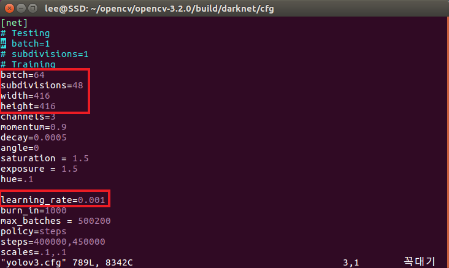
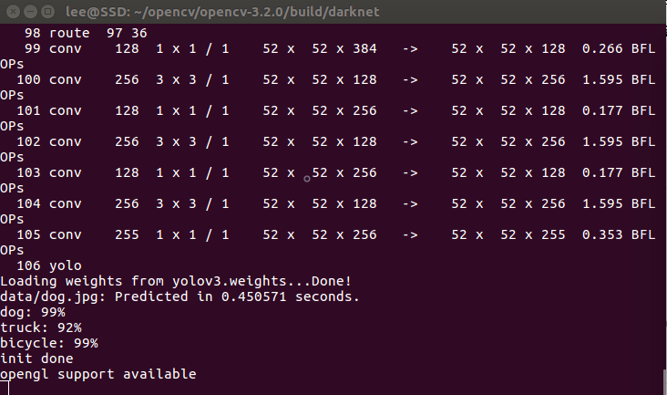
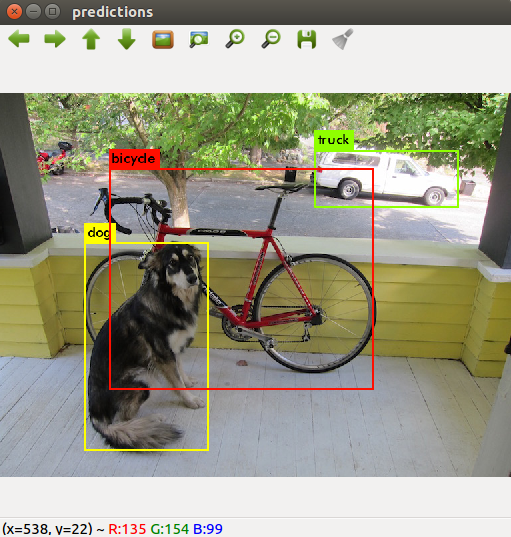

# YOLO install
설치하기에 앞서 CUDA, cuDNN, Opencv 3.2.0가 설치되었다는 가정하에 진행함.

>git clone https://github.com/pjreddie/darknet.git  
cd darknet  


Makefile을 편집기로 열어준다.  
```makefile
GPU=1
CUDNN=1
OPENCV=1
OPENMP=0
DEBUG=0
```

저장 후
>make

>cd cfg
>wget https://pjreddie.com/media/files/yolov3.weights

# Test
darknet이 설치된 폴더로 이동  
>./darknet detect cfg/yolov3.cfg cfg/yolov3.weights data/dog.jpg


이런 에러가 뜬다면 다음 명령어를 터미널에 입력

----------------------------------------------------
```
./darknet: error while loading shared libraries: libopencv_highgui.so.3.2: cannot open shared object file: No such file or directory
```
>sudo /bin/bash -c 'echo "/usr/local/lib" > /etc/ld.so.conf.d/opencv.conf'  
sudo ldconfig  
참조 : https://github.com/pjreddie/darknet/issues/382  

-----------------------------------------------------
```
CUDA Error: out of memory
darknet: ./src/cuda.c:36: check_error: Assertion `0' failed.
Aborted (core dumped)
```
이 오류는 그래픽카드 성능이 좋지않아서 임.  
>cd cfg  
gedit yolov3.cfg



- `batch` : 한 번에 몇 장을 처리할지 정한다. 웬만하면 건드리지 말자. ]
- `subdivisions` : batch를 이 값만큼 나누어서 처리한다. 이 부분을 적절히 수정해줄 필요가 있다. ]
- `height, width` : 입력되는 이미지의 크기다. ]  
- `learning_rate=0.001` : 그래픽 카드가 1개 그대로 두자. 만약 2개를 사용한다면 0.0005 가 된다. 4개는 0.00025]
-------------------------------------------------------

수정 후 다시 실행
>./darknet detect cfg/yolov3.cfg cfg/yolov3.weights data/dog.jpg






동영상 실행 시
>./darknet detector demo cfg/coco.data cfg/yolov3.cfg yolov3.weights [동영상 이름.확장자] 

웹캠 실행 시
>./darknet detector demo cfg/coco.data cfg/yolov3.cfg yolov3.weights 